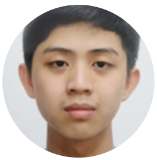
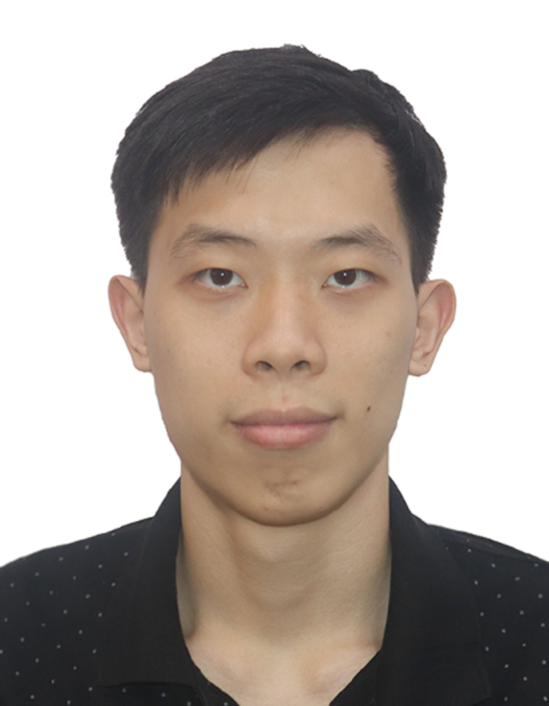
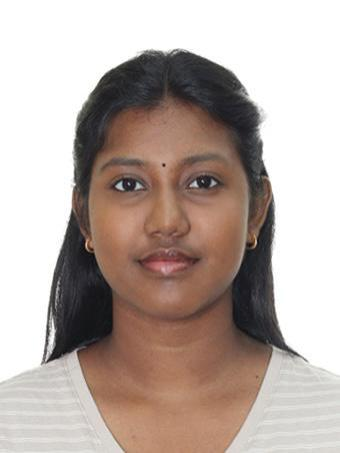
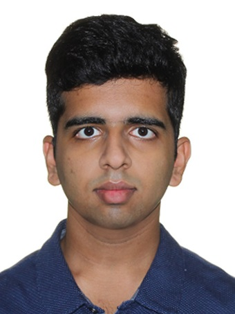

# About Us

We are a team based in the [School of Computing, National University of Singapore](http://www.comp.nus.edu.sg).

You can reach us at the email `seer[at]comp.nus.edu.sg`

## Project team

### Loh Wei Hung

[[github](https://github.com/weihungloh)]
[[portfolio](team/weihung.md)]

* Role: Project Advisor

### Liew Shuang Yuan 

[[github](http://github.com/shuang26)]
[[portfolio](team/shuang26.md)]

* Role: Developer
* Responsibilities: UI

### Kimberly Chieng

[[github](https://github.com/K1mcheee)] [[portfolio](team/k1mcheee.md)]

* Role: Developer
* Responsibilities: Data

### Ramesh Kumar Sahana Avantika

[[github](http://github.com/SahanaAvantika)]
[[portfolio](team/SahanaAvantika.md)]

* Role: Developer
* Responsibilities: Dev Ops + Threading

### Sivakumar Varun

[[github](http://github.com/varuuuun)]
[[portfolio](team/varuuuun.md)]

* Role: Developer
* Responsibilities: UI
