## CareBook User Guide

Welcome to CareBook! **Your classroom, organized.**

Designed with daycare teachers in mind, **CareBook** simplifies **daily roster management and parent communication** so you can focus on what matters the most - caring for children.

**:information_source: Notes about daycare teachers:** 

* We assume that the daycare teachers managing daily rosters of 30 to 40 children
* We assume that the daycare teachers using this product are tech-savvy and fast typers

With CareBook, you can:
- Instantly access **students’ and parents’ contacts**
- Streamline **daily attendance tracking** with simple commands
- Easily maintain **student records** for smooth communication

This user guide will walk you through:
- Setting up your CareBook application
- Navigating the Graphical User Interface (GUI) and Command Line Interface(CLI)
- Learning essential commands to help you manage contacts and attendance

By the end of this guide, you’ll be a **CareBook pro**, managing your daycare with ease and precision.

***
## Table of Contents
1. Quick start
   - [Installing CareBook](#installation)
   - [Introducing GUI](#introducing-gui)
   - [CLI Tutorial](#cli-tutorial)
1. Features
   - [Adding a student:](#adding-a-student) `add`
   - [Clearing CareBook:](#clearing-carebook) `clear`
   - [Deleting a student:](#deleting-a-student) `delete`
   - [Editing a student:](#editing-a-student) `edit`
   - [Exiting the program:](#exiting-the-program) `exit`
   - [Exporting attendance summary:](#exporting-attendance-summary) `export`
   - [Finding a student’s contact:](#finding-a-student-s-contact)`find`
   - [Viewing help:](#viewing-help) `help`
   - [Listing all students:](#listing-all-students) `list`
   - [Marking a student’s attendance:](#marking-a-student-s-attendance) `mark`
   - [Marking all students’ attendance:](#marking-all-students-attendance) `markall`
   - [Unmarking a student’s attendance:](#unmarking-a-student-s-attendance) `unmark`
   - [Unmarking all students’ attendance:](#unmarking-all-students-attendance) `unmarkall`
1. [Known Issues](#known-issues)
1. [FAQ](#faq)
1. [Command Summary](#command-summary)
***

## Quick Start

#### Installing CareBook
1. Ensure you have Java `17` or above installed in your computer.
    **Mac Users:** Ensure you have the precise JDK version prescribed [here](https://se-education.org/guides/tutorials/javaInstallationMac.html).
   <panel header="How to check your java version">
   <markdown>
   In your command terminal, type `java -version`
   </markdown>
   </panel>

2. Download your `carebook.jar` file with the latest release [here](https://github.com/AY2425S2-CS2103T-T11-2/tp/releases/tag/v1.4).
Scroll down all the way until you see **Assets** and click on `carebook.jar` to install.

3. Move the `.jar` file to the folder you want to use as the home folder for your CareBook.

4. Open a command terminal, `cd` into the folder you placed your .jar file and type `java -jar carebook.jar` and press enter to run CareBook application.
Here are detailed information as to how to change directory in [Windows](https://www.youtube.com/watch?v=BfXh11ryBJg) and [MacOS](https://www.youtube.com/watch?v=VRFcEMPES7U).
   <panel header="Changing directory">
   <markdown>
   If your folder is under `/home/user/CareBook`, simply type `cd /home/user/CareBook` and hit enter
   </markdown>
   </panel>

#### Introducing GUI
After successfully running CareBook application, a GUI similar to below should be displayed.

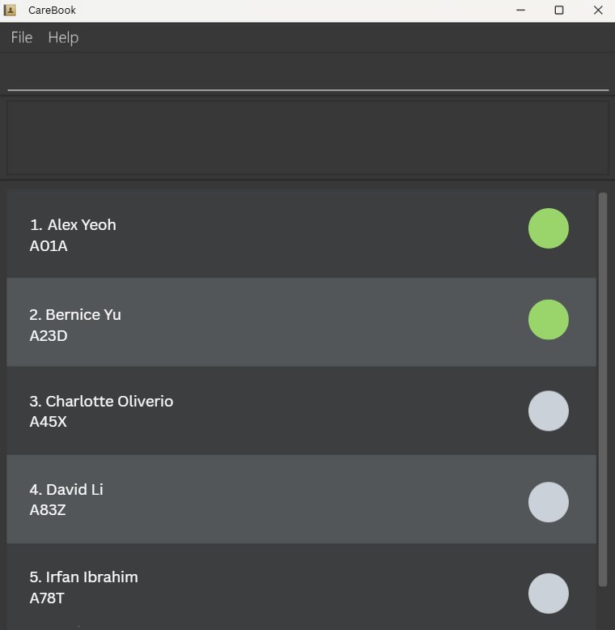

  💡 <strong>Tip:</strong> CareBook provides sample data in the first run.

#### CLI Tutorial
1. **Type Command:** Enter your command into the command box, highlighted with a yellow circle in the image below.  
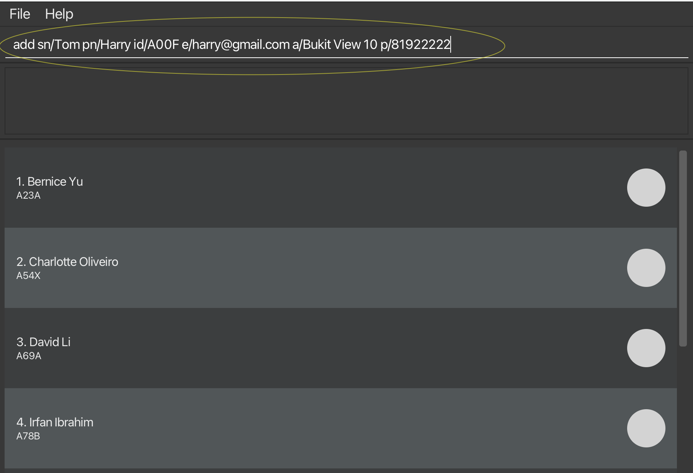

2. **Execute Command:** Press `Enter` to run your command.

3. **View Results:** After executing the command, you should see the student you just added as well as sample data
in the image below.  
   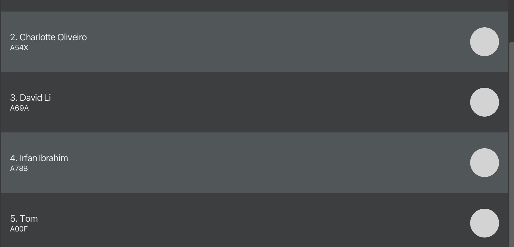

**Try These Example Commands**
* `help`: Opens the help window.
* `delete A00F`: Deletes the student you just added in step 1 of **type command**.
* `markall`: Marks all the students (including the sample data) as present.

For more details, see the [features section](#features).

&nbsp;

***

## Features

  ❗<strong>Warning:</strong> Please be careful when copying commands from a PDF version of this user guide. 
If a command is split across lines, spaces could be lost, which might cause errors when you paste 
it into the application.

#### Adding a student
You can add a student to CareBook.

  <strong>Command Format:</strong> <code>add &lt;sn/StudentName&gt; &lt;id/StudentId&gt; &lt;pn/ParentName&gt; &lt;p/Phone&gt; &lt;e/Email&gt; &lt;a/Address&gt;</code>

  <strong>Remarks:</strong>
  <ul>
    <li>Parameters can be added in <em>any order</em>, but all are compulsory.</li>
    <li>For names instead of "S/O" and "D/O" please use SO or DO.</li>
    <li>No restrictions to Address.</li>
    <li>Student ID should be <strong>4 characters</strong> beginning with A followed by 2 digits and ending with an alphabet.</li>
    <li>Phone number <strong>must</strong> range from 80000000 to 99999999.</li>
    <li>Email address should have an @ domain.</li>
  </ul>

  <strong>Examples:</strong>
  <ul>
    <li><code>add sn/Tom Hank id/A10A pn/Thomas Hank p/98122012 e/thomashank@hotmail.com a/Bukit View 9</code></li>
    <li><code>add pn/John Cena p/91029322 e/janeCena@hotmail.com a/Canberra Drive 9 sn/Jane Cena id/A99Z</code></li>
  </ul>

**Input:**  
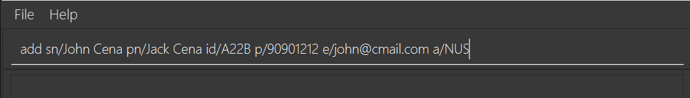

**Expected Output:**  
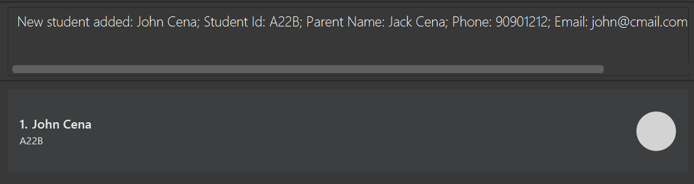

&nbsp;

#### Clearing CareBook
You can clear all student records in CareBook.

  ❗<strong>Warning:</strong> You cannot retrieve any cleared data. This action is <strong>IRREVERSIBLE</strong>.

  ℹ   <strong> Information:</strong> This command ignores any additional parameters received.

  <strong>Command Format:</strong> <code>clear</code>

**Input:**  

**Expected Output:**  

&nbsp;

#### Deleting a student
You can delete a student from CareBook.

  ❗<strong>Warning:</strong> You cannot retrieve any deleted student data. This action is <strong>IRREVERSIBLE</strong>.

  <strong>Command Format:</strong> <code>delete &lt;StudentId&gt;</code>

  <strong>Remarks:</strong>
  <ul>
    <li>Student ID should be one that already exists in CareBook.</li>
  </ul>

  <strong>Examples:</strong>
  <ul>
    <li><code>delete A10A</code></li>
    <li><code>delete A09B</code></li>
  </ul>

**Input:**  
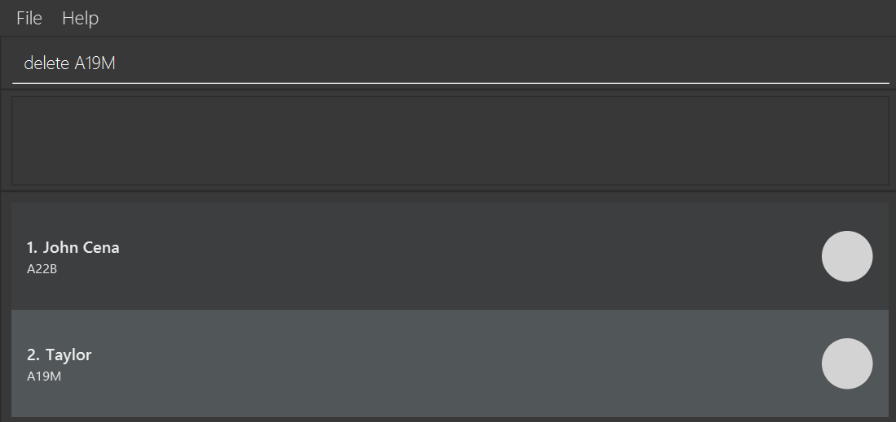

**Expected Output:**  
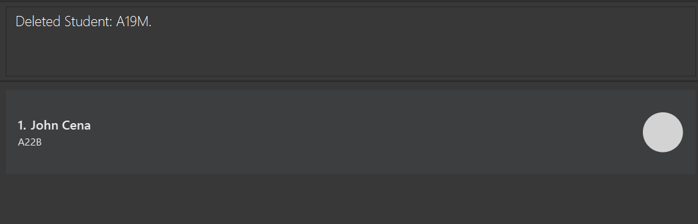

&nbsp;

#### Editing a student
You can edit a student's details in CareBook.

  <strong>Command Format:</strong> <code>edit &lt;StudentId&gt; &lt;sn/StudentName&gt; &lt;id/StudentId&gt; &lt;pn/ParentName&gt; &lt;p/Phone&gt; &lt;e/Email&gt; &lt;a/Address&gt;</code>

  <strong>Remarks:</strong>
  <ul>
    <li>There are no restrictions to Address.</li>
    <li>Parameters can be edited in <em>any order</em>.</li>
    <li>For names instead of "S/O" and "D/O" please use SO or DO.</li>
    <li>Student ID should be <strong>4 characters</strong> beginning with A followed by 2 digits and ending with an alphabet.</li>
    <li>Edited Student ID should be a new Student ID that has not been assigned to any students.</li>
    <li>Phone number should be from 80000000 to 99999999.</li>
    <li>Email address should have an @ domain.</li>
    <li><strong>At least one field</strong> is required in addition to providing the student ID of the student you want to edit.</li>
  </ul>

  <strong>Examples:</strong>
  <ul>
    <li><code>edit A10A sn/Tom Hank p/98122012 e/thomashank@hotmail.com a/Bukit View 9</code></li>
    <li><code>edit A99Z p/91029322 e/johnnyCena@gmail.com</code></li>
    <li><code>edit A99Z id/A88V</code></li>
  </ul>

**Input:**  
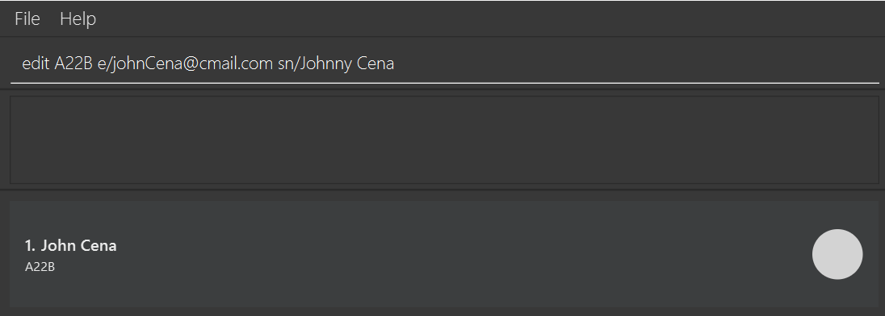

**Expected Output:**  
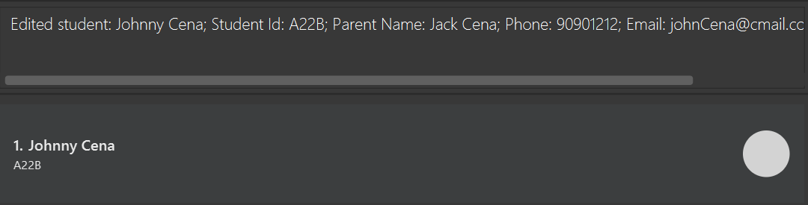

&nbsp;

#### Exiting the program
You can exit the program.

    <strong>ℹ  Information:</strong> This command ignores any additional parameters received.

  💡 <strong>Tip:</strong> Upon exiting, any data you have updated will automatically be saved.

  <strong>Command Format:</strong> <code>exit</code>

&nbsp;

#### Exporting attendance summary
You can export an attendance summary.  

  💡 <strong>Tip:</strong> The exported file will be automatically saved in .csv format, with a timestamp next 
        to the file name to help identify when it was created. It includes student ID, student name, parent name, 
parent's email, parent's phone number, and students' attendance history from CareBook.

  <strong>Command Format:</strong> <code>export &lt;FileName&gt;</code>

  <strong>Remarks:</strong>
  <ul>
    <li>File name should only consist of alphanumeric characters and underscores.</li>
    <li>Special characters including but not limited to * . / ‘ are invalid.</li>
  </ul>

  <strong>Examples:</strong>
  <ul>
    <li><code>export attendance_sheet</code></li>
    <li><code>export student_records</code></li>
  </ul>

**Input:**  
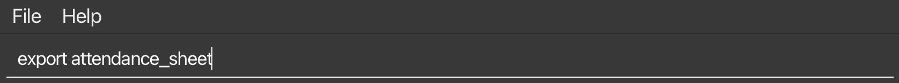

**Expected Output:**  
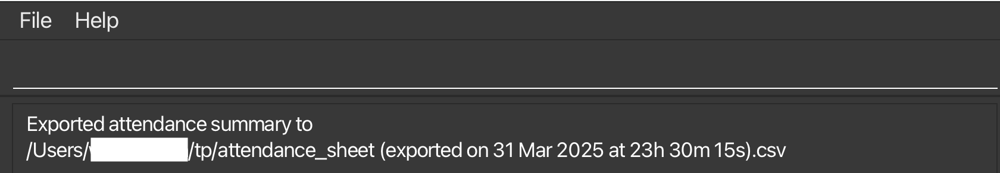

&nbsp;

#### Finding a student’s contact
You can find a specific student with matching Student ID.

  💡 <strong>Tip:</strong> A find window will open upon executing this command. Full contact information (from top to bottom order:
student name, student ID, parent name, parent's phone number, address, parent's email) of the student with a matching ID will be shown.

  <strong>Command Format:</strong> <code>find &lt;StudentId&gt;</code>

  <strong>Remarks:</strong>
  <ul>
    <li>Student ID must be one that already exists in CareBook.</li>
  </ul>

  <strong>Examples:</strong>
  <ul>
    <li><code>find A03A</code></li>
    <li><code>find A99Z</code></li>
  </ul>

**Input:**  
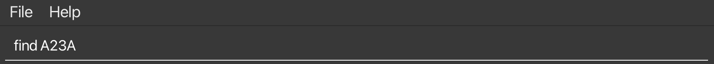

**Expected Output:**  
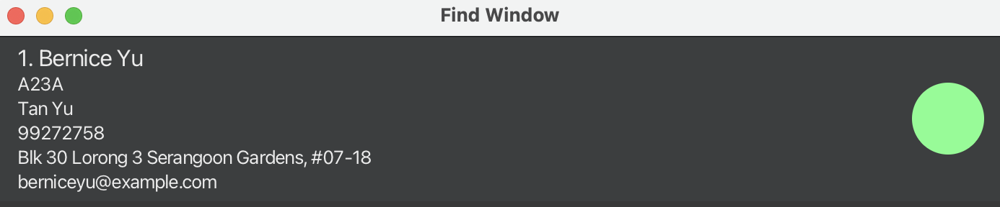

&nbsp;

#### Viewing help
you can open a help window with a link to CareBook user guide website.

    <strong>ℹ  Information:</strong> This command ignores any additional parameters received.

  💡 <strong>Tip:</strong> The help window also displays a summary of commands below the guide link.

  <strong>Command Format:</strong> <code>help</code>

**Input:**  
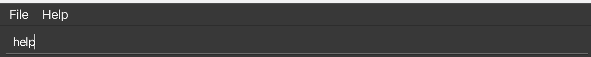

**Expected Output:**  
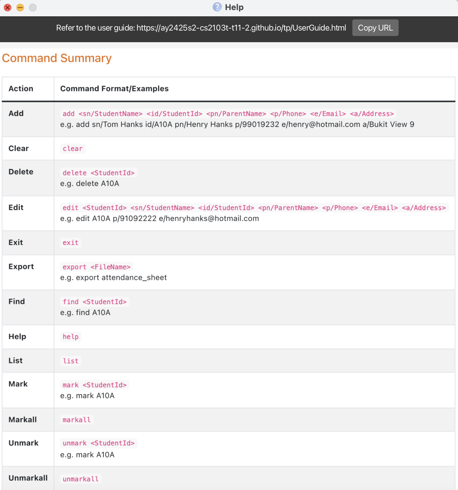  

A [command summary](#command-summary) will also be displayed below the guide link.

&nbsp;

#### Listing all students
You can list all students in CareBook.

    <strong>ℹ  Information:</strong> This command ignores any additional parameters received.

  <strong>Command Format:</strong> <code>list</code>

**Input:**  
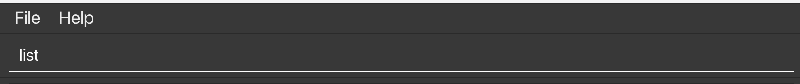

**Expected Output:**  
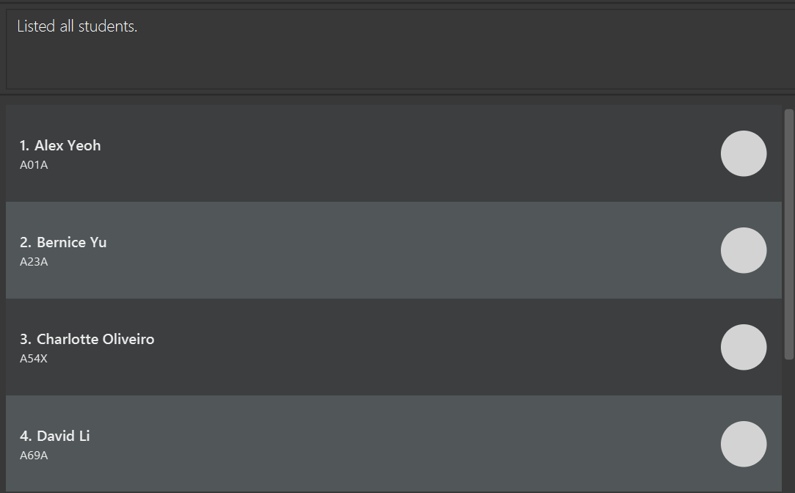

&nbsp;

#### Marking a student’s attendance
You can mark a student in CareBook as present.

  <strong>Command Format:</strong> <code>mark &lt;StudentId&gt;</code>

  <strong>Remarks:</strong>
  <ul>
    <li>Student ID must be one that already exists in CareBook.</li>
  </ul>

  <strong>Examples:</strong>
  <ul>
    <li><code>mark A10A</code></li>
    <li><code>mark A99Z</code></li>
  </ul>

**Input:**  
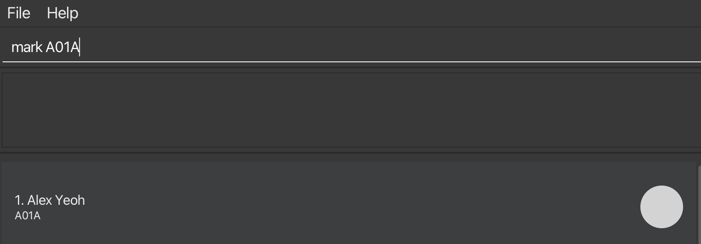

**Expected Output:**  
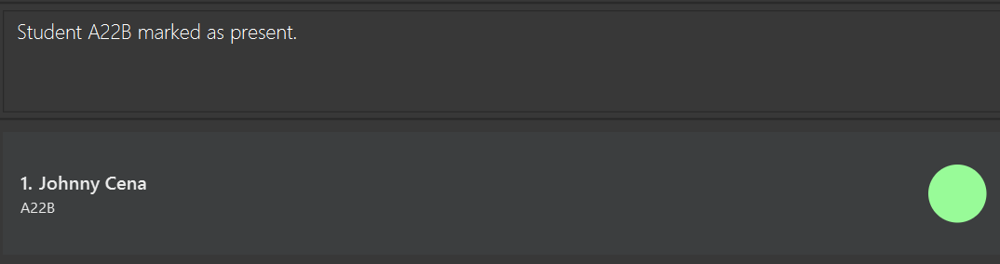

&nbsp;

#### Marking all students’ attendance
You can mark all students in CareBook as present.

    <strong>ℹ  Information:</strong> This command ignores any additional parameters received.

  <strong>Command Format:</strong> <code>markall</code>

  <strong>Remarks:</strong>
  <ul>
    <li>The command only works if there is at least one recorded student in CareBook.</li>
  </ul>

**Input:**  
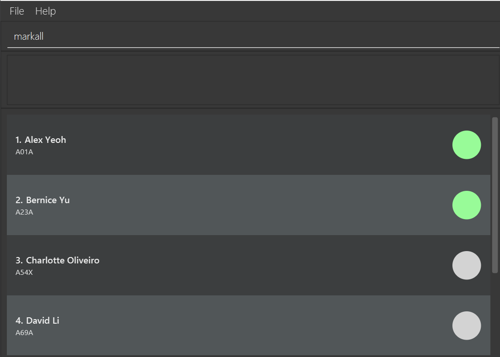

**Expected Output:**  
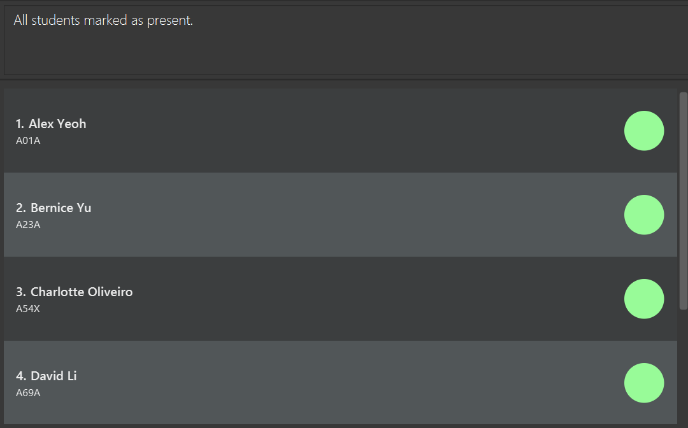

&nbsp;

#### Unmarking a student’s attendance
You can mark a student in CareBook as absent.

  <strong>Command Format:</strong> <code>unmark &lt;StudentId&gt;</code>

  <strong>Remarks:</strong>
  <ul>
    <li>Student ID must be one that already exists in CareBook.</li>
  </ul>

  <strong>Examples:</strong>
  <ul>
    <li><code>unmark A10A</code></li>
    <li><code>unmark A99Z</code></li>
  </ul>

**Input:**  
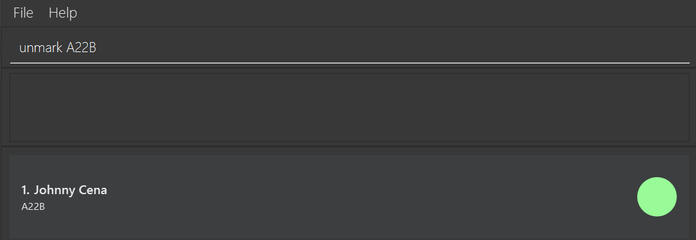

**Expected Output:**  
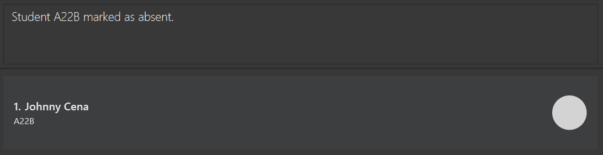

&nbsp;

#### Unmarking all students’ attendance
You can mark all students in CareBook as absent.

    <strong>ℹ  Information:</strong> This command ignores any additional parameters received.

  <strong>Command Format:</strong> <code>unmarkall</code>

  <strong>Remarks:</strong>
  <ul>
    <li>The command only works if there is at least one recorded student in CareBook.</li>
  </ul>

**Input:**  
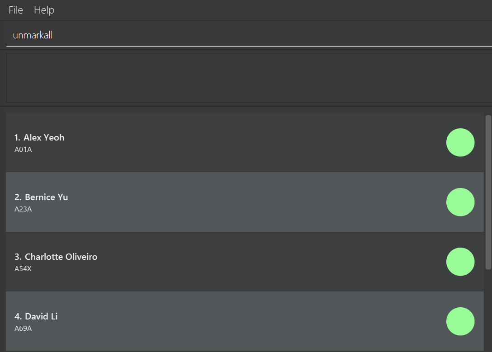

**Expected Output:**  
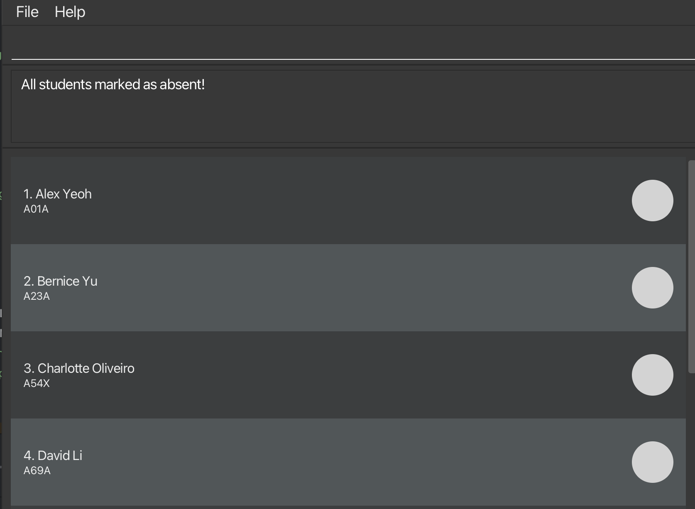

&nbsp;

***

## Known Issues

1. **Find window** cannot be maximized fully. However, since it only displays 1 student, you will still be able to view all details needed.
1. If you **execute another command with the find window open**, you will get a notification. Simply click "ok" to close it.
1. When **help window is minimized** and you run `help` again, the original window remains minimized. Simply restore the minimized window to view it again.
***

## FAQ

**Q:** Is CareBook and Java 17 free to download?  
**A:** Yes, they are both free to download!

**Q:** Do I need an internet connection to use CareBook?   
**A:** No, CareBook works **fully offline**. All data is stored locally on your device.

**Q:** Is my data automatically saved?  
**A:** Yes, CareBook **automatically saves** all changes after each command. No need to manually save!

**Q:** How do I start using this application if I am a novice user?  
**A:** Execute `help` command to check the commands available. For more information about the command usage 
of each command, see the [features section](#features).

**Q:** Is there a way to recover deleted or cleared student records?  
**A:** No, `clear` and `delete <StudentId>` are **IRREVERSIBLE**.

***

## Command Summary
| Action        | Command Format/Examples                                                                                                                                                               |
|---------------|---------------------------------------------------------------------------------------------------------------------------------------------------------------------------------------|
| **Add**       | `add <sn/StudentName> <id/StudentId> <pn/ParentName> <p/Phone> <e/Email> <a/Address>`  e.g. add sn/Tom Hanks id/A10A pn/Henry Hanks p/99019232 e/henry@hotmail.com a/Bukit View 9 |
| **Clear**     | `clear`                                                                                                                                                                               |
| **Delete**    | `delete <StudentId>`   e.g. delete A10A                                                                                                                                           |
| **Edit**      | `edit <StudentId> <sn/StudentName> <id/StudentId> <pn/ParentName> <p/Phone> <e/Email> <a/Address>`   e.g. edit A10A p/91092222 e/henryhanks@hotmail.com                           |
| **Exit**      | `exit`                                                                                                                                                                                |
| **Export** | `export <FileName>`  e.g. export attendance_sheet                                                                                                                                 |
| **Find**      | `find <StudentId>`   e.g. find A10A                                                                                                                                               |
| **Help**      | `help`                                                                                                                                                                                |
| **List**      | `list`                                                                                                                                                                                |
| **Mark**      | `mark <StudentId>`   e.g. mark A10A                                                                                                                                               |
| **Markall**   | `markall`                                                                                                                                                                             |
| **Unmark**    | `unmark <StudentId>`   e.g. mark A10A                                                                                                                                             |
| **Unmarkall** | `unmarkall`                                                                                                                                                                           |
